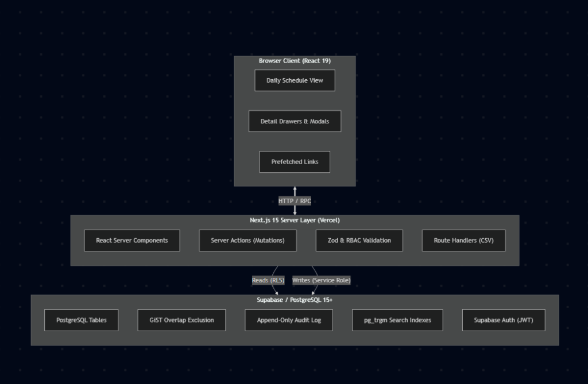

# Architecture

Answer each of these, in your own words, once the system has taken real shape.

- What are the moving pieces, and how do they talk to each other?
- Where does each piece run?
- What is the request path for one representative user action, end to end?
- What did you decide *not* to build, and why?

---

## 1. What are the moving pieces, and how do they talk to each other?

ClinicFlow is built as a cohesive full-stack web application designed without an unnecessary standalone Express or NestJS microservice. There are three primary moving pieces:

| Tier | Primary Components | Core Responsibilities | Protocols & Communication |
| :--- | :--- | :--- | :--- |
| **🌐 Client Tier** | **Browser Application** *(React 19 / Next.js Client)* | • Daily Schedule Calendar grid • Appointment detail drawers & modals • Patient search & multi-field filters • Sub-80ms `<Link prefetch>` navigation | ⇄ **HTTP / RPC**: Dispatches Server Actions with typed JSON arguments; renders streamed React Server Components. |
| **⚡ Server Tier** | **Next.js 15 App Router** *(Vercel Serverless Lambdas)* | • React Server Components (zero-JS initial paint) • Server Actions for all mutations • Zod input validation & RBAC (`requireRole`) • Route Handlers (CSV Schedule export) | ⇄ **Dual Database Connection**: • *Reads:* User-session client (RLS applied) • *Writes:* Service-role admin client (trusted) |
| **🗄️ Database Tier** | **Supabase / PostgreSQL 15+** *(Managed Cloud Instance)* | • Relational tables with strict foreign keys • GiST exclusion constraint (`btree_gist`) • Trigram search indexes (`pg_trgm`) • Append-only legal audit log • Supabase Auth engine & encrypted sessions | 🔒 **Storage Engine**: Enforces atomic transaction locks, range exclusions, and read-only RLS security policies. |

> **Direct Data Flow Pipeline:**  
> `Browser (React 19)` ⟵ *(HTTP POST / Server Actions)* ⟶ `Next.js 15 Server Layer` ⟵ *(Session Reads with RLS / Trusted Admin Writes)* ⟶ `Supabase / PostgreSQL`

### The Moving Pieces

1. **The Browser Client (React 19 / Next.js Client Components):**  
   Handles user interaction, local form state, modal dialogs (such as slot generation and patient creation), and tab navigation. It relies on React Server Components for heavy initial page rendering, using lightweight client components only where DOM event listeners or form states are necessary.

2. **The Next.js 15 App Router Server Layer:**  
   Acts as both the backend application server and the UI renderer:
   - **React Server Components (RSCs):** Fetch data directly on the server to stream HTML down to the browser with zero client JavaScript waterfalls.
   - **Server Actions (`lib/*/actions.ts`):** Type-safe RPC endpoints that handle all mutations (booking, status changes, care team assignments, note editing).
   - **Domain & Validation Engine (`lib/validation`, `lib/appointments/status.ts`, `lib/appointments/permissions.ts`):** Enforces role-based permissions, Zod input validation, and state machine transition rules before touching the database.
   - **Route Handlers (`app/api/schedules/csv`):** Stream binary or file data (e.g. Schedule CSV exports) with session authentication checks.

3. **The Supabase / PostgreSQL Database Layer:**  
   Houses all relational tables, authentication records, database constraints, and extensions:
   - **PostgreSQL Storage Engine:** Enforces foreign keys, check constraints, and the GiST exclusion constraint (`btree_gist` + `tstzrange`) preventing double bookings.
   - **Supabase Auth:** Manages secure password hashing (bcrypt), session tokens, and encrypted HTTP-only cookies.
   - **Row-Level Security (RLS):** Protects tables by granting read-only `SELECT` permissions to authenticated users while blocking direct client writes.

### How They Talk to Each Other

- **Browser ⇄ Next.js Server:** The browser communicates with Server Components and Server Actions over standard HTTPS requests using Next.js's built-in RPC protocol. Fast navigation is achieved via `<Link prefetch={true} />`, which fetches server components ahead of time.
- **Next.js Server ⇄ PostgreSQL:** The server connects to PostgreSQL using two distinct patterns:
  1. *For Data Reads:* It uses a session-bound client (`lib/supabase/server.ts`) passing the user's auth token. This ensures all database reads strictly obey Row-Level Security (RLS).
  2. *For Data Mutations:* It uses the service-role admin client (`lib/supabase/admin.ts`). Once the Server Action verifies identity, checks role permissions (`requireRole`), and validates inputs, it executes the write as a trusted process. This architectural separation guarantees that public clients have **zero direct write access** to any table (especially the append-only audit log).

---

## 2. Where does each piece run?

| Piece | Runtime Environment | Hosting Infrastructure |
| :--- | :--- | :--- |
| **Browser Client** | User's web browser (V8, WebKit, Gecko) | Client-side device (desktop, tablet, mobile) |
| **Edge Routing & Session Proxy** | Next.js Middleware (`middleware.ts`) | Vercel Edge Network / Serverless Edge Functions |
| **Application Backend** | Node.js Serverless Runtime (Server Actions, RSCs, Route Handlers) | Vercel Serverless Functions |
| **Database & Authentication** | PostgreSQL 15+ with `pgcrypto`, `btree_gist`, `pg_trgm` | Supabase Cloud (AWS us-east-1) with PgBouncer Connection Pooling |

* **Client-side execution is intentionally minimal:** Only user interaction handling, modal toggling, and client-side form controls run in the browser.
* **All critical business logic runs on the server:** Permissions, state machine validations, alert derivation rules, and audit logging execute within secure serverless lambdas.
* **Concurrency guarantees execute directly inside the database:** Range locks and overlap exclusion constraints run within PostgreSQL's storage engine.

---

## 3. What is the request path for one representative user action, end to end?

Let's trace a core operational workflow: **A Front Desk staff member books an open appointment slot for a patient.**

| Step | Action Stage | Actor / Layer | Technical Operation & Integrity Guard |
| :---: | :--- | :--- | :--- |
| **1** | **User Gesture** | 👤 Front Desk Staff | Clicks "Book Appointment" on Dr. Alice's 09:00 AM slot, selects patient Maya Rodriguez, and clicks Confirm. |
| **2** | **Action Dispatch** | 🌐 Browser Client | Invokes `bookAppointmentAction({ appointmentId, patientId })` via an encrypted HTTP POST request. |
| **3** | **Auth Check** | ⚡ Next.js Server | `requireAuth()` inspects incoming HTTP-only cookies and validates the Supabase JWT. Rejects if missing or expired. |
| **4** | **RBAC Authorization** | ⚡ Next.js Server | `requireRole('front_desk')` asserts that the authenticated user possesses administrative scheduling authority. |
| **5** | **Zod Validation** | ⚡ Next.js Server | Validates input parameters against `bookAppointmentSchema` (UUID format, non-empty values). |
| **6** | **State Pre-check** | ⚡ Next.js Server | Queries slot to verify `patient_id IS NULL AND status IS NULL` (ensuring slot hasn't been claimed). |
| **7** | **Database Mutation** | 🗄️ PostgreSQL | Updates row: `UPDATE appointments SET patient_id = $1, status = 'requested', updated_at = now()`. |
| **8** | **Atomic Lock Check** | 🗄️ PostgreSQL | Storage engine atomically evaluates CHECK constraints and the GiST exclusion constraint (`appointments_no_overlap`). |
| **9** | **Audit Trail Logging** | 🗄️ PostgreSQL | Appends row to `appointment_audit_events` with `event_type = 'STATUS_CHANGED'`, `actor_id`, and state snapshot. |
| **10** | **Cache Invalidation** | ⚡ Next.js Server | Calls `revalidatePath('/schedule')` & `revalidatePath('/appointments')` to purge stale server caches. |
| **11** | **UI State Refresh** | 🌐 Browser Client | Next.js streams updated Server Component payload; browser transitions slot into an active booked tile with a toast. |

### Detailed Step-by-Step Breakdown:

1. **User Interaction (Browser):**  
   The front-desk receptionist opens the Daily Schedule view, clicks on an open 30-minute availability slot under Dr. Alice, selects patient "Maya Rodriguez" from the search dropdown, and clicks **"Confirm Booking"**.

2. **Client Component Dispatch:**  
   The client component triggers the `bookAppointmentAction` Server Action, transmitting `{ appointmentId, patientId }` over an encrypted HTTP POST request.

3. **Authentication & Session Check (Server):**  
   The Server Action calls `requireAuth()`, which extracts and verifies the user's Supabase JWT from incoming encrypted HTTP-only request cookies. If expired or missing, it immediately throws an unauthorized error.

4. **Role & Permission Verification:**  
   The action calls `requireRole('front_desk')`, verifying that the user has administrative scheduling authority.

5. **Schema Validation:**  
   The payload is validated against `bookAppointmentSchema` using Zod to ensure UUIDs are well-formed.

6. **Domain Pre-condition Check:**  
   The server queries the slot to verify that `patient_id IS NULL` and `status IS NULL`. If another receptionist booked it a fraction of a second earlier, it immediately returns a friendly conflict error.

7. **Database Mutation:**  
   The action issues an `UPDATE public.appointments SET patient_id = $1, status = 'requested', updated_at = now() WHERE id = $2` via the service-role client.

8. **PostgreSQL Constraint Enforcement:**  
   - PostgreSQL verifies the `appointments_slot_or_appointment` CHECK constraint (both `patient_id` and `status` must be populated together).
   - PostgreSQL evaluates the `appointments_no_overlap` GiST exclusion constraint on `(provider_id WITH =, service_range WITH &&)`. Because Dr. Alice has no overlapping active appointments in that time window, the transaction commits atomically.

9. **Audit Log Appending:**  
   Immediately upon successful update, the server inserts an immutable audit row into `appointment_audit_events` with `event_type = 'STATUS_CHANGED'`, `old_status = NULL`, `new_status = 'requested'`, `actor_id = session.user.id`, and structured snapshot metadata.

10. **Cache Invalidation & UI Refresh:**  
    The server calls `revalidatePath('/schedule')` and `revalidatePath('/appointments')`. Next.js re-renders the affected React Server Components and streams the updated HTML/JSON back to the browser. The schedule tile updates instantly from an open slot to a styled "Requested" booking card with a success notification.

---

## 4. What did you decide *not* to build, and why?

To deliver a high-quality, production-grade scheduling engine within the time budget, I made deliberate, disciplined decisions on what **not** to build:

### 1. Patient-Facing Self-Service Portal
* **What was omitted:** Public patient registration, patient logins, and self-service booking links.
* **Why:** The project specification explicitly states that patients are managed strictly by clinic staff, not system users. Introducing public authentication, magic links, and patient profile portals would have added significant surface area and diluted focus away from the core requirements: provider schedule management, care team collaboration, and clinic operational flow.

### 2. Real-Time WebSockets / Postgres Change Subscriptions
* **What was omitted:** Persistent WebSocket connections pushing live updates to the browser on every database change.
* **Why:** Real-time subscriptions introduce significant client state synchronization complexity, reconnection edge cases, and connection exhaustion on free-tier PostgreSQL instances. In real clinic workflows, receptionists work through task lists and navigate between views. Standardizing on Server Actions paired with Next.js `revalidatePath()` gives immediate, predictable UI updates for the active user with zero persistent connection overhead.

### 3. Drag-and-Drop Calendar Rescheduling
* **What was omitted:** Dragging and dropping appointment blocks across dates and times on the calendar grid.
* **Why:** Drag-and-drop on mobile devices and touch tablets is notoriously error-prone. An accidental brush of a finger can unintentionally reschedule a patient's surgery without warning. I chose an explicit modal-based rescheduling flow where staff must deliberately pick an open slot and confirm the change, ensuring safety and audit compliance.

### 4. Heavy Third-Party Charting Packages (Recharts / Chart.js)
* **What was omitted:** Pulling in large third-party charting libraries for the dashboard's 8-week no-show trend visualization.
* **Why:** Full charting libraries add 200KB–400KB of client JavaScript and frequently cause SSR hydration warnings in Next.js 15 App Router. Instead, I built a custom SVG/HTML bar chart directly with Tailwind CSS. It renders completely on the server with **zero client JavaScript**, zero hydration risk, and instant page loads.

### 5. Multi-Clinic Tenancy Architecture
* **What was omitted:** Adding `clinic_id` columns, multi-tenant database partitioning, and tenant isolation policies.
* **Why:** Multi-tenancy is classic premature optimization for a single-clinic scheduling application. Adding tenant layers across every query, index, and RLS policy would add code clutter and slow down development without providing any value for the single-facility use case.